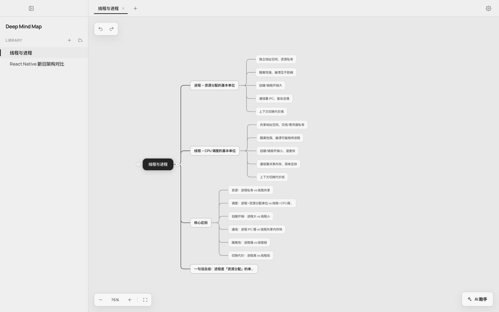
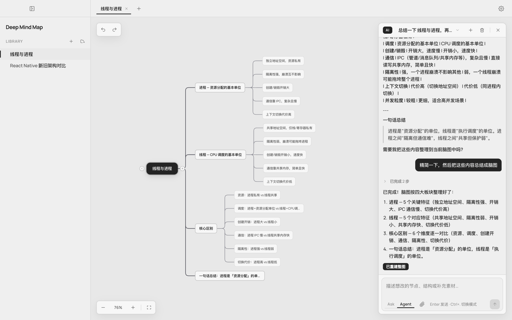
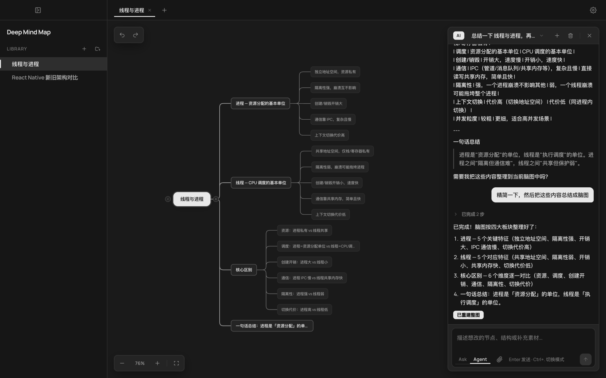

# Deep Mind Map

**用你自己的 AI，在本地把知识变成可编辑的思维导图。**

数据落在你的电脑上，没有产品方账号墙；密钥与模型自己配；需要备份时，再手动同步到你自己的 GitHub 仓库。

[下载最新版](https://github.com/yizhao6985-ai/deep-mind-map/releases/latest) · [从源码运行](#从源码运行) · [Star](https://github.com/yizhao6985-ai/deep-mind-map)



---

## 为什么用它

- **本地优先** — 图库与配置在本机，学习笔记不经过第三方云账号。
- **AI 自备** — OpenAI 兼容 / Anthropic / 本地 Ollama，费用与隐私自己掌控。
- **对话改图** — 在画布旁用 Agent 生成、精简、重组节点，再手动微调。
- **可选备份** — 手动推送 / 拉取到你自己的 GitHub 仓库，和本开源仓库无关。

---

## 看看界面

侧栏图库、多 Tab 画布、右下角 AI 浮岛，同一工作区完成整理。



也支持浅色 / 深色 / 跟随系统。



---

## 你能做什么

| | |
|---|---|
| **图库** | 文件夹与思维导图新建、重命名、删除；打开即自动保存 |
| **画布** | 增删改节点、折叠、自动右向布局、撤销 / 重做、缩放适应 |
| **AI** | Ask 问答 · Agent 改图；流式进度、附件、按图多段对话 |
| **外观** | 跟随系统 / 浅色 / 深色 |
| **同步** | （可选）GitHub 授权后，在设置里手动推送或拉取 `.dmm.json` |

单人深度编辑：节点位置由布局算法计算，不做实时协作。

---

## 怎么用

1. 安装并打开 Deep Mind Map  
2. 在设置（或首次引导）里配置你的 API Key / Ollama  
3. 新建或打开一张图，点右下角 **AI 助手**，用 Agent 生成或改结构  
4. 需要换机或备份时，到设置里推送到你自己的仓库（或稍后使用导入导出）

默认图库目录：`~/Documents/DeepMindMap/`

---

## 下载

安装包筹备中。正式发版后可在此获取：

**→ [GitHub Releases（Latest）](https://github.com/yizhao6985-ai/deep-mind-map/releases/latest)**

| 平台 | 安装包 |
|------|--------|
| macOS | `.dmg` |
| Windows | 安装程序 |

也可先从源码运行（见下）。

---

## 从源码运行

```bash
git clone https://github.com/yizhao6985-ai/deep-mind-map.git
cd deep-mind-map
npm install
npm run dev
```

```bash
npm test
npm run typecheck
npm run build    # 编译到 out/
npm run dist     # 打包（electron-builder）
```

### 可选：GitHub 同步（Device Flow）

若要用应用内同步，需自建启用了 **Device Flow** 的 GitHub OAuth App（公开客户端，只需 Client ID）：

1. [GitHub → OAuth Apps](https://github.com/settings/developers) → New OAuth App  
2. Homepage 可用本仓库地址；Callback 填任意有效 URL（如 `http://127.0.0.1`，Device Flow 不走回调）  
3. 勾选 **Enable Device Flow**  
4. 将 Client ID 设为环境变量 `DMM_GITHUB_CLIENT_ID`，或写入 `electron/main/github-oauth-config.ts`  

Scope：`repo` + `read:user`。

---

## 即将支持

- 导图样式切换（classic / compact / card）
- 导入 / 导出菜单入口（含更多导出格式）
- 侧栏拖拽整理文件夹

---

## 文档与开源

| 文档 | 说明 |
|------|------|
| [产品需求（PRD）](docs/PRD.md) | 场景、边界与验收 |
| [视觉设计](docs/design-system.md) | 工作区壳与视觉规范 |
| [技术设计](docs/tech-design.md) | 架构、存储与模块 |

开源协议：[MIT](LICENSE)。欢迎 Issue / PR；改需求请先对照 PRD 与设计规范中的术语。
