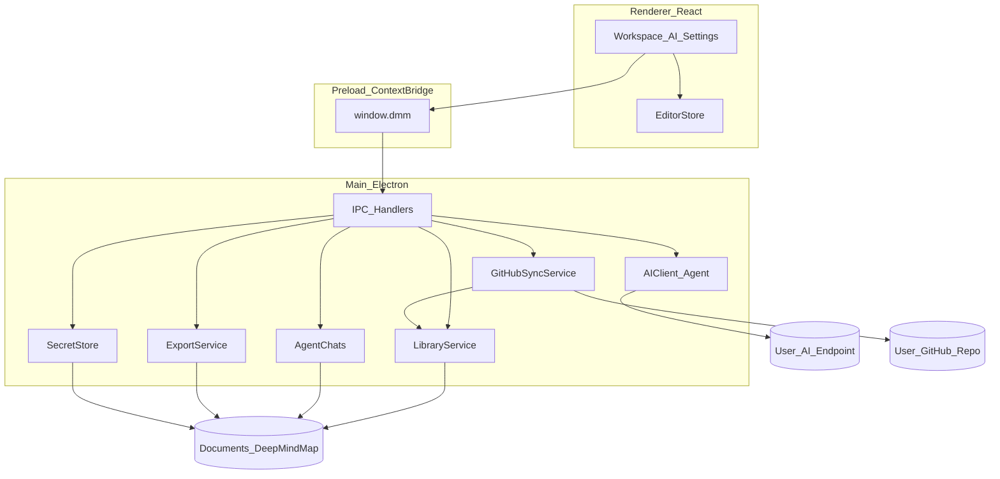
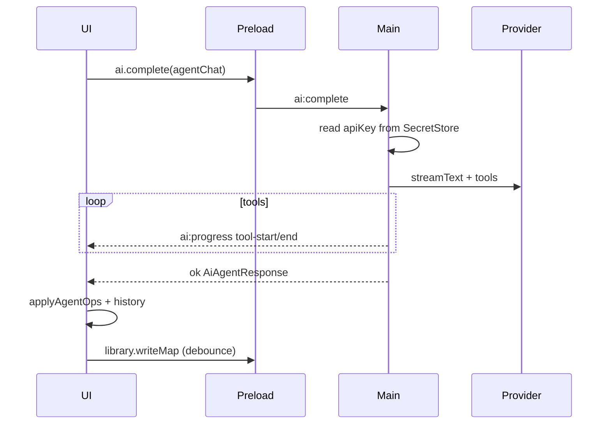
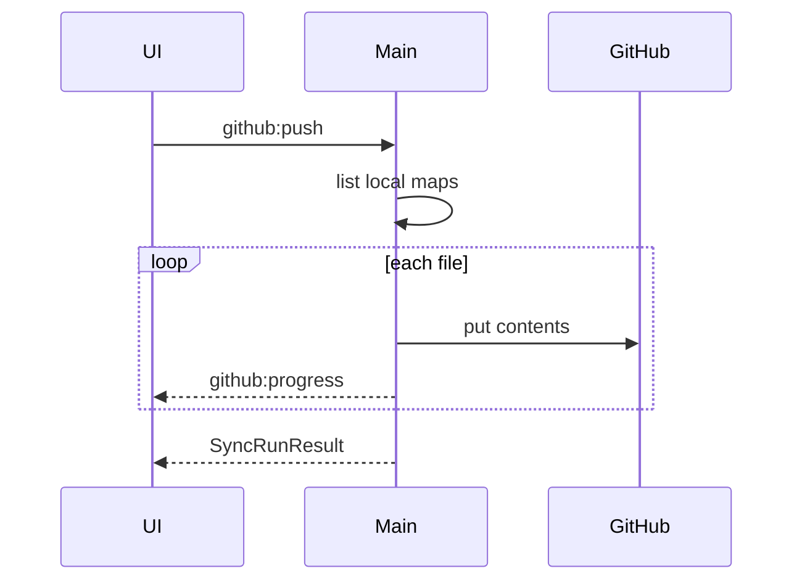

# Deep Mind Map — 开发设计文档

| 字段 | 内容 |
|------|------|
| 产品名 | Deep Mind Map |
| 版本 | MVP 0.1 |
| 形态 | 本地 Electron 桌面应用（开源） |
| 关联文档 | [PRD](./PRD.md) · [视觉设计规范](./design-system.md) |
| 状态 | Active（与当前实现对齐） |

本文档将 [PRD](./PRD.md) 落实为技术设计：架构、栈、模块边界、数据与 IPC、安全与里程碑。视觉 Token 以 [design-system.md](./design-system.md) 与 `src/styles/tokens.css` 为准。

---

## 1. 目标与范围

### 1.1 技术目标

- 可运行的本地桌面应用（优先 macOS / Windows；Linux 尽力支持）。
- 思维导图与设置落盘本机；密钥用系统安全存储。
- AI 请求仅发往用户配置的 Provider；GitHub 同步仅发往用户自有仓库。
- `.dmm.json` 同版本可往返；工作区壳 + Agent 改图为当前主路径。

### 1.2 技术非目标（当前）

- 实时协作、产品方后端 / 账号体系。
- MapStyle 切换 UI、自定义主题编辑器、插件市场。
- 节点自由拖放布局。
- 自动后台同步、Git LFS。
- 原生移动端。

---

## 2. 总体架构



**原则**

- **主进程**：文件系统、密钥、网络（AI / GitHub）、导出写文件。
- **渲染进程**：UI 与编辑态；不直接 `fs` / 不持有明文长期密钥。
- **Preload**：仅暴露白名单 `window.dmm.*`；`contextIsolation: true`，`nodeIntegration: false`（当前 `sandbox: false`）。

---

## 3. 技术选型（锁定）

| 层级 | 选型 | 理由 |
|------|------|------|
| 运行时 | Electron 35 | 桌面壳 + Chromium |
| 构建 | electron-vite 3 + TypeScript 5.8 | 主/预加载/渲染一体、HMR |
| UI | React 19 + 全局 CSS 变量（`tokens.css`） | 对齐 design-system；无 Tailwind |
| 路由 | react-router-dom 7（HashRouter） | `#/onboarding`、`#/`、`#/maps/:id` |
| 状态 | Zustand 5 | 编辑器 / Tab / UI |
| 画布 | `@xyflow/react` 12 + 自研右向树布局 | `nodesDraggable={false}`；坐标由 `layoutMindMap` 写入 |
| 撤销 | EditorStore 快照栈（约 50 步） | 结构变更可撤销 |
| HTTP / AI | `ai` 7 + `@ai-sdk/openai` + `@ai-sdk/anthropic` | Agent：`streamText` + tools；旧动作：`generateObject` |
| GitHub | `@octokit/rest` + Device Flow | Contents API 推送拉取 |
| 密钥 | Electron `safeStorage` | 不可用时回退明文 JSON（实现已有） |
| 校验 | Zod 3 | `MindMapFile` schema |
| 测试 | Vitest 3 | 布局 / schema / 模型能力启发式 |
| 打包 | electron-builder | dmg / nsis；脚本 `npm run dist` |
| 包管理 | **npm**（非 pnpm） | 仓库含 `package-lock.json` |

字体：Google Fonts **Manrope** + **IBM Plex Mono**（`src/index.html`）。

---

## 4. 仓库与目录结构（实际）

```
deep-mind-map/
├── docs/
│   ├── PRD.md
│   ├── design-system.md
│   └── tech-design.md
├── electron/
│   ├── main/
│   │   ├── index.ts
│   │   ├── paths.ts
│   │   ├── result.ts
│   │   ├── github-oauth-config.ts
│   │   ├── ipc/index.ts
│   │   └── services/
│   │       ├── library.ts
│   │       ├── settings.ts
│   │       ├── secrets.ts
│   │       ├── ai.ts
│   │       ├── agent-tools.ts
│   │       ├── agent-chats.ts
│   │       ├── attachments.ts
│   │       ├── export.ts
│   │       ├── github-auth.ts
│   │       └── github-sync.ts
│   └── preload/index.ts
├── src/                              # Renderer
│   ├── main.tsx
│   ├── index.html
│   ├── app/                          # App, theme, dialogs, uiStore, tabStore
│   ├── features/
│   │   ├── workspace/                # WorkspacePage, WorkspaceSidebar
│   │   ├── canvas/                   # MindCanvas, editorStore, nodes/edges
│   │   ├── ai-panel/                 # AiPanel + Agent UI
│   │   ├── settings/                 # SettingsPanel
│   │   └── onboarding/               # OnboardingPage
│   ├── components/ui/
│   ├── shared/
│   │   ├── types/                    # domain, api
│   │   ├── schema/
│   │   ├── mindmap/                  # layout, tree, convert
│   │   └── ai/                       # modelCapabilities
│   └── styles/tokens.css
├── package.json
├── electron.vite.config.ts
├── vitest.config.ts
├── README.md
└── LICENSE
```

共享类型在 `src/shared`；主进程经 TS path 引用同一 schema，避免双源漂移。

---

## 5. 进程与 IPC

### 5.1 安全基线

- `contextIsolation: true`
- `nodeIntegration: false`
- `sandbox: false`（当前实现）
- Preload：`contextBridge.exposeInMainWorld('dmm', api)`

### 5.2 IPC 通道（白名单，与 `window.dmm` 一致）

| 通道 | 方向 | 说明 |
|------|------|------|
| `library:list` | inv | 图库树（folders + 扫描 maps） |
| `library:readMap` / `writeMap` | inv | 读 / 写思维导图 |
| `library:createMap` / `renameMap` / `deleteMap` / `moveMap` | inv | 思维导图 CRUD |
| `library:createFolder` / `renameFolder` / `deleteFolder` / `moveFolder` | inv | 文件夹 CRUD |
| `settings:get` / `settings:set` | inv | 非密钥设置 |
| `secrets:set` / `has` / `delete` | inv | 仅 `'ai.apiKey'`；GitHub Token 仅主进程 |
| `ai:test` / `ai:complete` / `ai:abort` / `ai:capabilities` | inv | AI；进度事件 `ai:progress` |
| `agentChats:list` / `get` / `upsert` / `setActive` / `delete` | inv | 按 map 持久化对话 |
| `attachments:read` | inv | 读附件为 `AiAttachment` |
| `export:write` | inv | 写用户所选路径（内容由渲染侧提供） |
| `import:openDmm` / `import:openMarkdown` | inv | 系统对话框读入 |
| `dialog:open` / `dialog:save` | inv | 通用文件对话框 |
| `github:authStatus` / `connect` / `cancelConnect` / `disconnect` | inv + `github:auth-code` | Device Flow |
| `github:test` | inv | 测试同步仓库可达 |
| `github:push` / `pull` | inv + `github:progress` | 手动同步 |
| `app:getPaths` | inv | `libraryRoot` / `userData` |

约定：返回 `DmmResult<T>` = `{ ok: true, data } | { ok: false, code, message }`；`message` 为中文用户文案。

---

## 6. 本地存储设计

### 6.1 路径

默认根目录：`path.join(app.getPath('documents'), 'DeepMindMap')`（可设置 `libraryPath` 覆盖）。

```
DeepMindMap/
├── settings.json
├── secrets.bin                 # safeStorage 加密密钥包
└── library/
    ├── index.json              # 仅 folders
    ├── <map-id>.dmm.json       # 根目录思维导图
    ├── <FolderName>/...        # 文件夹内思维导图
    └── agent-chats/
        └── <map-id>.json       # 该图的对话索引与消息
```

### 6.2 `settings.json`

```json
{
  "schemaVersion": 1,
  "libraryPath": null,
  "locale": "zh-CN",
  "onboardingCompleted": false,
  "themeMode": "system",
  "ai": {
    "providerType": "openai-compatible",
    "baseUrl": "",
    "model": "",
    "temperature": 0.7
  },
  "github": {
    "owner": "",
    "repo": "",
    "branch": "main",
    "pathPrefix": "mindmaps/",
    "displayName": ""
  },
  "recentMapIds": []
}
```

密钥不在此文件：`ai.apiKey`、`github.token`（兼容旧键 `github.pat`）存 secrets。

### 6.3 思维导图文件

每张图一份 `MindMapFile`：

```ts
type MindMapFile = {
  schemaVersion: 1
  app: 'deep-mind-map'
  updatedAt: string
  exportedAt?: string
  map: {
    id: string
    title: string
    mapStyle: 'classic' | 'compact' | 'card'
    folderId: string | null
    nodes: MindNode[]
  }
}
```

**权威结构**：`parentId` + `order`；渲染时由 React Flow 派生边。导入导出与 GitHub 共用同一序列化。

### 6.4 Schema 校验

- Zod：`src/shared/schema/mindmap.ts`
- 导入 / 拉取：校验失败拒绝；版本不兼容提示；MVP 仅 v1

### 6.5 其它本机状态

- 侧栏宽度：`localStorage`（`dmm.sidebarWidth`）
- 主题：`html[data-theme='light'|'dark']`，由 `themeMode` 解析

---

## 7. 领域模块设计

### 7.1 LibraryService

- `index.json` 维护文件夹；扫描 `*.dmm.json` 得到 maps
- 原子写：`*.tmp` 再 rename
- 打开时写入 `recentMapIds`（最多 20）

### 7.2 Editor（渲染进程）

- `editorStore`：`file`、`selectedId`、`dirty`、`past`/`future`、`aiBusy`
- 操作：`addChild`、`addSibling`、`deleteNode`、`setText`、`toggleCollapse`、`setMapStyle`、`replaceMap`、`refineLayout`
- 自动保存：Workspace 脏标记后约 **700ms** debounce → `library.writeMap`
- `setMapStyle` 已实现但无 UI 入口

### 7.3 布局与画布

- `layoutMindMap(nodes, mapStyle, measured?)`：右向树；classic / compact / card 不同 metrics
- DOM measured 后 `refineLayout` / `anchorLayout` 精修
- React Flow：交互与肘线边；**不可拖拽节点**

### 7.4 AIClient（主进程）

- 按 `settings.ai.providerType` 构造模型（OpenAI / Anthropic / Ollama 经 OpenAI 兼容口）
- **主路径 `agentChat`**：
  - `streamText` + `createMindMapAgentTools`
  - Ask：只读工具（`getMapOutline` / `findNodes` / `getNode`）
  - Agent：另含 `replaceMap` / `expandNode` / `updateNodeText` / `addChild` / `deleteNode`
  - 进度经 `ai:progress` 推送；`ai:abort` 中止
- **遗留动作**（无独立 UI）：`generateFromTopic` / `generateFromNotes` / `expandNode` / `explainNode` / `simplifyNode`（`generateObject`）
- `PROMPT_VERSION` 见 `ai.ts`；错误映射中文
- 附件：`attachments:read`；能力启发式 `modelCapabilities`

### 7.5 AgentChats

- 路径：`library/agent-chats/<mapId>.json`
- 索引：`activeId` + `conversations[]`

### 7.6 ExportService

| 格式 | 现状 |
|------|------|
| `.dmm.json` | 与磁盘格式一致；写文件 IPC 就绪 |
| Markdown | `mapToMarkdown` / `markdownToDraft` 就绪 |
| SVG / PNG / PDF | IPC 接受 content；**渲染侧栅格化未实现** |

产品菜单入口未接线。

### 7.7 GitHubSyncService

- Device Flow：`github-auth.ts`；Client ID：`DMM_GITHUB_CLIENT_ID` 或 `BUILTIN_CLIENT_ID`
- Push / Pull：Contents API；冲突用 `updatedAt` / 内容比较；UI 三选一
- 进度：`github:progress`；授权码：`github:auth-code`

---

## 8. 前端界面映射

| PRD 界面 | 路由 / 视图 | 主要依赖 |
|----------|-------------|----------|
| Onboarding | `#/onboarding` | settings + ai:test |
| Workspace | `#/`、`#/maps/:id` | library + editorStore + tabStore |
| AI 浮岛 | Workspace 内 overlay | ai.complete(agentChat) + agentChats |
| Settings | Workspace 内替换主区（非独立路由） | settings / secrets / github |
| Export/Import | — | IPC 就绪，**无 UI** |

文案以组件内中文为主；视觉见 design-system 与 `tokens.css`。

---

## 9. 安全与隐私

| 项 | 设计 |
|----|------|
| API Key / GitHub Token | `safeStorage`；IPC 不回传 Token；UI 不回显明文 Key |
| 日志 | 禁止打印 Authorization |
| 思维导图文件 | 不含密钥；同步不同步 secrets 与 agent-chats |
| 网络 | AI / GitHub 仅主进程 |

---

## 10. 错误模型

```ts
type DmmErrorCode =
  | 'VALIDATION'
  | 'NOT_FOUND'
  | 'IO'
  | 'UNAUTHORIZED'
  | 'FORBIDDEN'
  | 'TIMEOUT'
  | 'NETWORK'
  | 'SCHEMA_INCOMPATIBLE'
  | 'CONFLICT'
  | 'CANCELLED'
  | 'UNKNOWN'
```

---

## 11. 测试策略

| 层级 | 覆盖（当前） |
|------|----------------|
| 单测 | `layout.test.ts`、`modelCapabilities.test.ts`、`fitViewOnce.test.ts` |
| 未覆盖 | IPC 集成、GitHub mock、E2E |

CI 建议：`typecheck` + `test`。

---

## 12. 构建与发布

```bash
npm run dev       # electron-vite dev
npm run build     # → out/
npm run dist      # build + electron-builder --dir
npm test
npm run typecheck
```

产物目录：`release/`；appId：`com.deepmindmap.app`。  
应用 semver 与文件 `schemaVersion` 分离。

---

## 13. 里程碑与模块映射

| 里程碑 | 模块 | 状态 |
|--------|------|------|
| M1 | Electron 壳、Library、Canvas CRUD、自动保存、工作区壳、tokens | 完成 |
| M2 | SecretStore、AI Agent（Ask/Agent）、对话持久化、附件 | 完成 |
| M3 | MapStyle 切换 UI | 布局/CSS 有；入口未做 |
| M4 | 导入导出产品入口；PNG/SVG/PDF | 部分后端；UI 未做 |
| M5 | GitHub Device Flow、冲突 UI、进度与错误映射 | 完成 |

---

## 14. 关键时序

### 14.1 Agent 改图



### 14.2 GitHub 推送



---

## 15. 风险与对策

| 风险 | 对策 |
|------|------|
| 大图布局卡顿 | 折叠子树；后续可 Worker |
| Provider 工具调用不稳定 | fallback 文案；失败不静默写盘 |
| GitHub API 限流 | 提示稍后再试 |
| safeStorage 不可用 | 回退并提示；避免无告知明文 |
| React Flow 与思维导图 UX 差异 | 禁拖拽；只允许树操作 API |

---

## 16. 文档维护

- 需求变更先改 [PRD](./PRD.md)，再改本文与 [design-system](./design-system.md)。
- 实现偏离须回写本文选型表与目录 / IPC。
- 术语与 PRD §8 一致：Library、Map、Node、MapStyle、Provider、Agent、Ask、Device Flow、GitHub Sync、ThemeMode。
